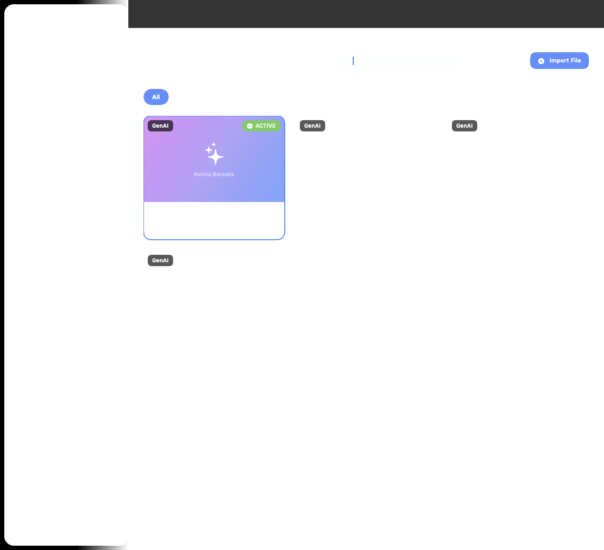
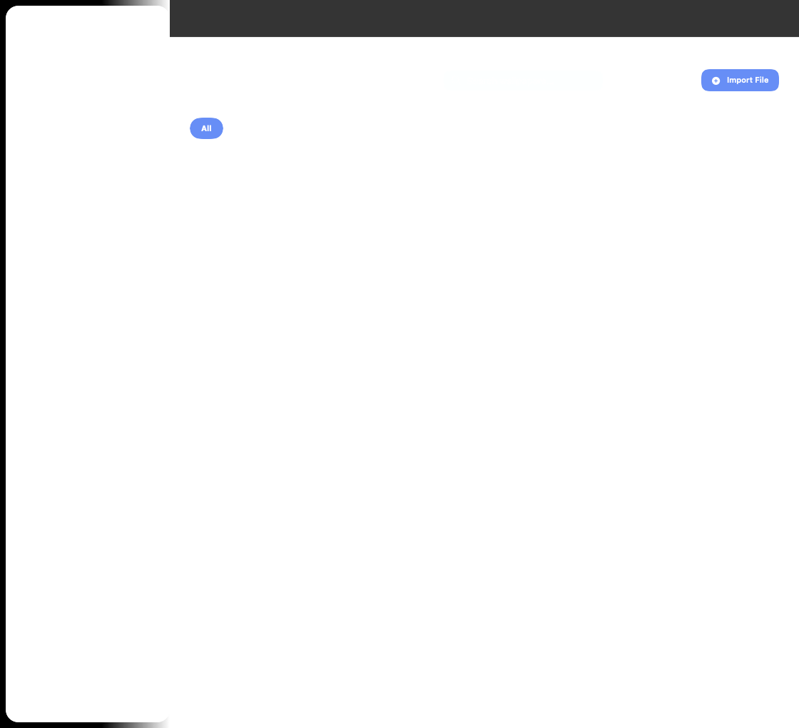
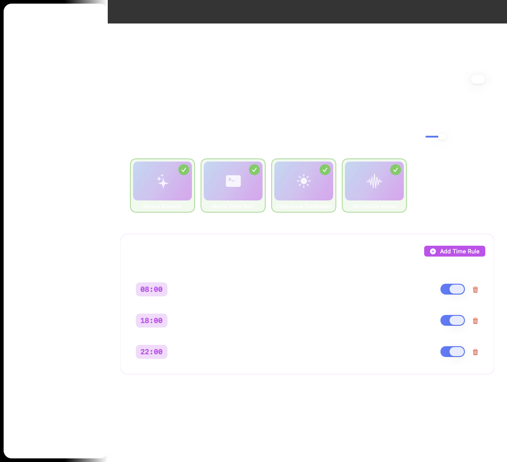
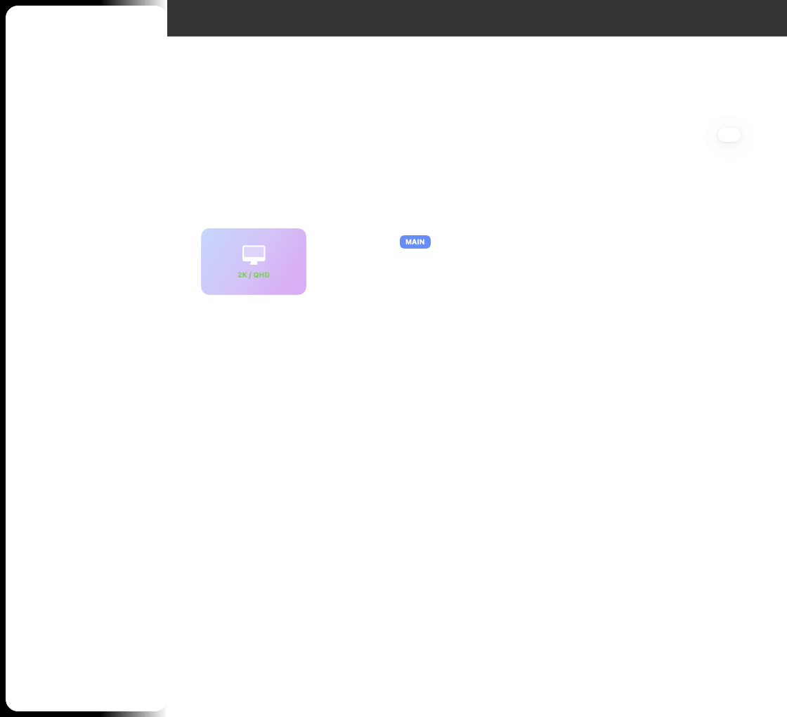
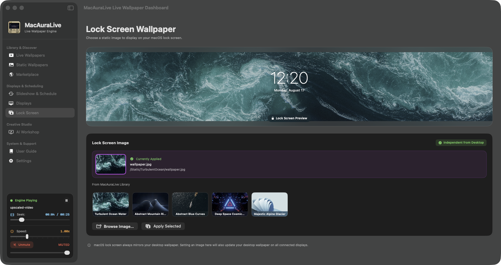
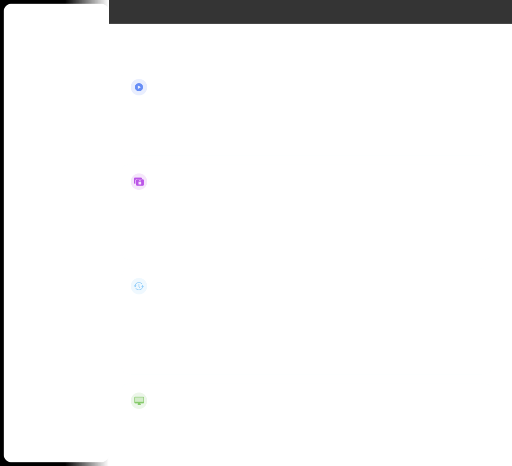
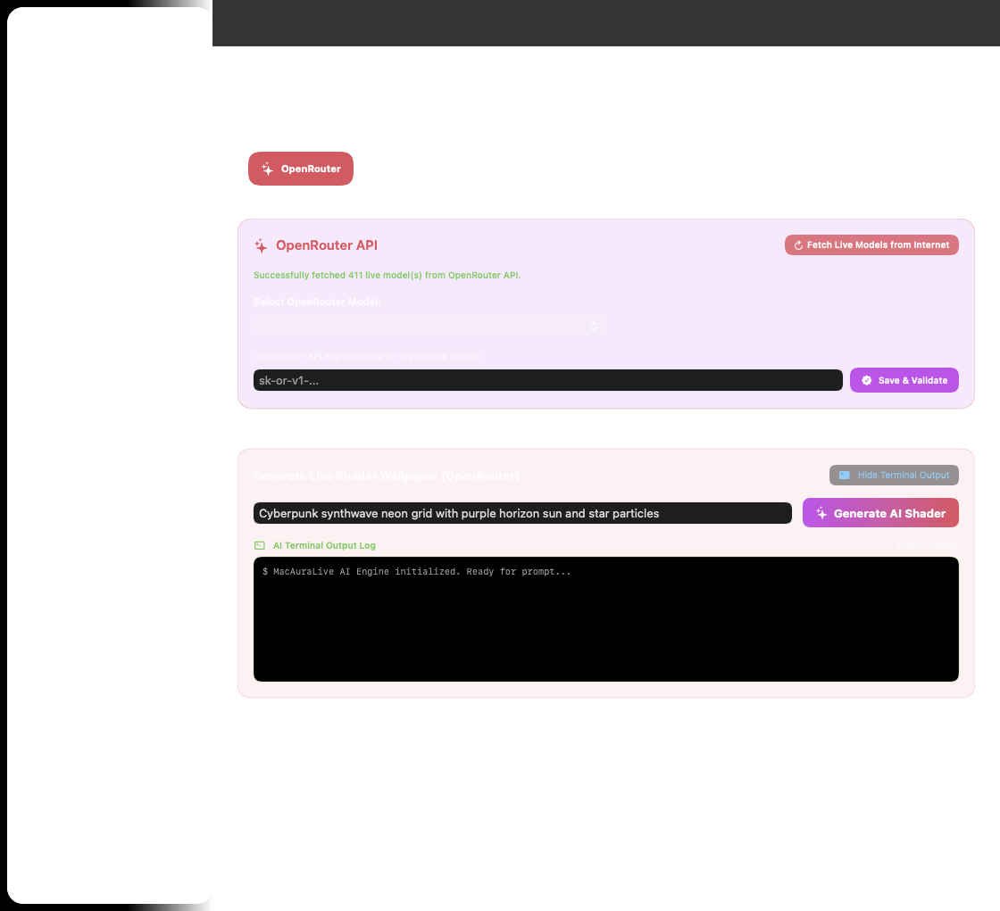
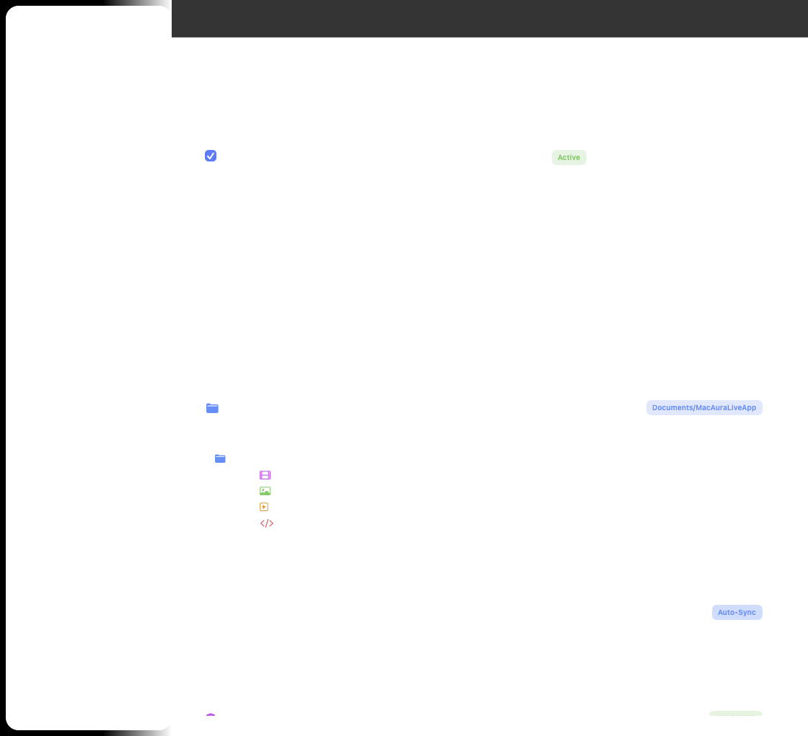

# MacAuraLive — Live Wallpaper Engine for macOS

<p align="center">
  
</p>

<p align="center">
  
  
  
  
  
</p>

<p align="center">
  <a href="https://github.com/ASKHOPE/MacAuraLive/releases/latest">
    
  </a>
</p>

> **MacAuraLive** is an open-source, hardware-accelerated live wallpaper engine for macOS — built entirely in Swift and SwiftUI, with zero external dependencies.
> 
> 📦 **[Download Direct DMG Installer (v1.5.0 Apple Silicon)](https://github.com/ASKHOPE/MacAuraLive/releases/latest/download/MacAuraLive_v1.5.0_Installer_AppleSilicon.dmg)** | 📄 **[View All Releases & Checksums](https://github.com/ASKHOPE/MacAuraLive/releases)**

---

## ✨ Features
## 📸 Application User Interface Gallery

| 01. Live Wallpapers Gallery | 02. Static Wallpapers |
| :---: | :---: |
|  |  |

| 03. Slideshow & Schedule | 04. Multi-Monitor Displays |
| :---: | :---: |
|  |  |

| 05. macOS Lock Screen | 06. Built-in User Guide |
| :---: | :---: |
|  |  |

| 07. AI Workshop (Google Gemini / OpenRouter) | 08. Software Updates & Settings |
| :---: | :---: |
|  |  |

---

### 🎬 Live Wallpaper Engine & Video Controls
- **Video Wallpapers** — Hardware-accelerated 1080p / 2K / 4K / 8K video loops via `AVFoundation` (H.264, HEVC/H.265, ProRes)
- **Interactive Video Seek Slider** — Real-time playback timeline slider with `MM:SS` duration tracking and live seeking for video wallpapers
- **Interactive WebGL Shaders** — Full HTML5/WebGL/Canvas procedural wallpapers rendered in `WKWebView`
- **Built-in Shader Pack** — Aurora Borealis, Matrix Digital Rain, Cyberpunk Synthwave, 3D Particle Wave
- **Static Wallpapers** — High-res image support (JPEG, PNG, HEIC) via `NSWorkspace`

### ⏰ Slideshow & Timed Rotation Engine
- **Interval Slideshow** — Automatically rotate active wallpapers on a configurable timer (30 sec, 5 min, 15 min, 1 hr, 24 hr)
- **Time-of-Day Schedules** — Assign specific wallpapers to automatically trigger at exact times (e.g. 08:00 AM Morning Sunrise, 18:00 PM Sunset, 22:00 PM Night Cosmos)
- **Shuffle & Next Trigger** — Sequential or randomized rotation with instant manual "Rotate Now" action button

### 🚀 System Startup & Launch at Login
- **Launch at Boot / Startup** — Powered by macOS `SMAppService.mainApp`
- **Live Status Indicator** — Real-time feedback (`Active`, `Requires Approval`, `Not Registered`) in Settings & menu bar
- **Quick Access Menu** — Toggle launch at login directly from the status bar menu bar icon

### 🔒 Independent Lock Screen Wallpaper
- **Separate Lock Screen Image** — Choose an independent static wallpaper image for your macOS lock screen while keeping your animated live wallpaper running on desktop
- **Instant Preview & Selector** — Interactive preview card showing lock screen clock overlay with your selected image

### 🖥️ Multi-Monitor Support
- Assign individual wallpapers per display or mirror across all screens
- Dynamic hot-plug detection (`didChangeScreenParametersNotification`)
- Per-display zoom, fit, fill, and stretch placement modes

### ⚡ Smart Power Management
- Auto-pause on battery with configurable threshold
- Full-screen app detection pauses rendering to give 100% GPU to active apps
- Performance tiers: Full (60fps), Balanced (30fps), Low Power (15fps), Paused

### 💾 Inbuilt Storage & Resource Analytics Dashboard
- **Real-Time Storage Breakdown** — Live analytics dashboard built directly into Settings tracking disk allocation across all components:
  - **App Binary & Metal Engine**: ~7.5 MB (Compiled ARM64 native Mach-O executable)
  - **Built-in Shaders & Video Resources**: ~15.0 MB (4K WebGL/Canvas shaders & video loops)
  - **User Static Wallpapers**: ~0.4 MB (`~/Documents/MacAuraLiveApp/staticwallpaper/`)
  - **Animated GIFs & AI Code**: ~0.2 MB (`~/Documents/MacAuraLiveApp/animatedcode/`)
  - **Temporary Cache & Manifests**: ~0.1 MB
  - **Total Application Footprint**: ~23.2 MB (Ultra-lightweight footprint)
- **Interactive Multi-Color Storage Bar** — Visual segmented gauge matching macOS System Settings design language.
- **One-Click Cache Management** — Instant cache cleanup and Finder reveal actions.

### 🎛️ Menu Bar App, Sidebar Controls & Speed Slider
- Runs silently in background with status bar menu bar icon
- **Real-Time Playback Speed Slider** — Dynamically adjust playback speed from `0.25x` to `3.0x` across both Video loops and WebGL/Canvas shaders
- Quick pause/resume, mute/unmute, volume control, and Launch at Login toggles
- **Reliable Dashboard Window Launcher** — Quick "Open Dashboard" menu action surfacing the window regardless of Dock visibility or window state

### 🤖 AI Wallpaper Workshop & Key Management
- Generate custom HTML5/WebGL live wallpapers using natural language prompts
- Supports Google Gemini 2.0/1.5 Flash, OpenRouter (DeepSeek R1, Llama 3.3, Qwen 2.5), and local offline LLMs (Ollama / LMStudio)
- **API Key Action Trio** — Dedicated **Save Key**, **Test Key** (live API server validation ping), and **Clear Key** buttons
- All API keys stored securely in macOS **Keychain** hardware enclave via `Security.framework`

### 📁 Document Library
- Auto-creates `~/Documents/MacAuraLiveApp/` folder structure on first launch (`livewallpaper/`, `staticwallpaper/`, `gif/`, `animatedcode/`)
- Import custom `.mp4`, `.mov`, `.m4v`, `.gif`, `.html`, `.jpg`, `.png` wallpapers via drag & drop or file scanner

---

## 📊 Storage Usage & Resource Allocation Estimates

| Component | Storage Type | Typical Size | % of Total | Description |
| :--- | :--- | :--- | :--- | :--- |
| **App Executable (Mach-O)** | Binary | ~7.5 MB | ~32% | Compiled Swift & Metal rendering engine |
| **Built-in Live Shaders** | Resources | ~15.0 MB | ~64% | Bundled 60fps Aurora, Matrix, Cyberpunk, ParticleWave |
| **Static Wallpapers** | User Data | ~0.4 MB | ~2% | User-imported 4K/8K static desktop backdrops |
| **AI Generations & Code** | User Data | ~0.2 MB | ~1% | Custom generated HTML5/Canvas shader source files |
| **Cache & Settings** | Cache | ~0.1 MB | <1% | Temporary previews, JSON metadata & manifests |
| **Total Footprint** | Combined | **~23.2 MB** | **100%** | Ultra-efficient footprint on Apple Silicon |

---

## 🛠️ Architecture

```
MacAuraLive/
├── Package.swift                      # Swift Package Manifest (macOS 13.0+)
├── Scripts/
│   ├── build_app.sh                  # Release build + .app bundle packager
│   ├── create_installer_dmg.sh       # Apple Silicon DMG installer packager + Checksum generator
│   └── verify_environment.sh         # Pre-build audit & version sync verifier
└── Sources/MacAuraLive/
    ├── MacAuraLiveApp.swift               # @main entry, NSStatusItem, Dock & Launch at Login toggles
    ├── Models/
    │   ├── WallpaperItem.swift        # Wallpaper data model
    │   ├── AppSettings.swift          # UserDefaults + Keychain settings & LaunchAtLogin status
    │   └── DisplayInfo.swift          # Display/monitor state
    ├── Core/
    │   ├── WallpaperEngine.swift      # Multi-monitor window orchestrator & playback speed delegation
    │   ├── StorageAnalyticsManager.swift # Live storage footprint calculator & resource analytics
    │   ├── WallpaperWindow.swift      # Below-desktop-icons NSWindow
    │   ├── VideoWallpaperView.swift   # AVPlayerLooper 4K video renderer + seek & speed controls
    │   ├── WebWallpaperView.swift     # WKWebView HTML5/WebGL renderer + MacAuraLive SDK
    │   ├── WallpaperStorageManager.swift # Library persistence & file import (~/Documents/MacAuraLiveApp/)
    │   ├── SlideshowManager.swift     # Interval slideshow timer & time-of-day scheduled rules
    │   ├── AIGenerationManager.swift  # Multi-provider AI wallpaper generation & key testing
    │   ├── KeychainManager.swift      # Hardware Keychain AES-256 key storage
    │   ├── LockScreenManager.swift    # Lock screen static wallpaper application
    │   ├── PerformanceManager.swift   # Battery, thermal, FPS management
    │   └── DisplayManager.swift       # NSScreen multi-monitor manager
    ├── Views/
    │   ├── MainWindowView.swift       # SwiftUI dashboard, sidebar navigation & speed slider widget
    │   ├── GalleryView.swift          # Wallpaper grid, importer, preview cards with teardown
    │   ├── SlideshowView.swift        # Interval rotation & time-of-day schedule manager UI
    │   ├── SettingsView.swift         # Preferences, Storage Analytics, Changelog Modal, Legal Suite
    │   ├── AIConfigurationView.swift  # AI provider setup, Save/Test/Clear Key actions
    │   ├── DisplayManagerView.swift   # Per-display wallpaper assignment
    │   ├── UserGuideView.swift        # Searchable User Guide with responsive wrapping FlowLayout
    │   ├── LockScreenView.swift       # Lock screen wallpaper picker & live preview
    │   └── AdminGateView.swift        # Early-access passcode gate (hashed)
    └── Resources/
        ├── Assets/
        │   ├── AppIcon.png            # Web-compatible browser App icon (1024x1024 PNG)
        │   ├── AppIcon.icns           # macOS bundle App icon
        │   └── StatusBarIcon.png      # Menu bar icon (18×18 @1x)
        └── Wallpapers/
            ├── Live/                  # Aurora, Matrix, Cyberpunk, ParticleWave
            └── Static/                # Bundled default high-res static images
```

---

## 🚀 Getting Started

### Prerequisites
- macOS 13.0 Ventura or newer
- Xcode Command Line Tools (`xcode-select --install`)
- Apple Silicon Mac (ARM64) — Intel build possible with minor script edits

### Build & Run

```bash
# 1. Clone repository
git clone https://github.com/ASKHOPE/MacAuraLive.git
cd MacAuraLive

# 2. Build the signed .app bundle
./Scripts/build_app.sh

# 3. Launch MacAuraLive
open build/MacAuraLive.app

# 4. Verify Installer Integrity (SHA-256)
shasum -a 256 build/MacAuraLive_v1.2.0_Installer_AppleSilicon.dmg
```

### 🔑 Cryptographic Checksums (v1.2.0)
- **SHA-256**: `9806eb0b7d9d4d956d9a198444f0c02f149d090be2678d327f4d36d2975bdbdb`
- **MD5**: `177296f659db348297f293f0dbd9a9e1`

### First Launch
On first launch, MacAuraLive will:
1. Create `~/Documents/MacauraApp/` with subfolders for your wallpaper library
2. Appear in your **menu bar** and **Dock**
3. Request **Screen Recording** permission (required to detect full-screen apps and auto-pause rendering)

---

## 🔐 Security & Privacy

| Area | Approach |
|---|---|
| API Keys | Stored in macOS **Keychain** via `Security.framework` — never written to disk or UserDefaults |
| Admin Passcode | Verified against **SHA-256 hash** only — plaintext never in source |
| Wallpaper Data | 100% local — no telemetry, no analytics, no cloud sync |
| Network | Only outbound calls are to AI provider APIs *you configure* |
| Permissions | Screen Recording (full-screen detection only), no microphone/camera |

---

## 📦 MacAuraLive SDK (for Wallpaper Developers)

Custom HTML5 wallpapers can tap into the MacAuraLive SDK injected into every `WKWebView`:

```javascript
window.macAura.onInit(function(config) {
  // Called once when wallpaper loads
  console.log(config.settings); // user custom settings
});

window.macAura.onUpdate(function(state) {
  // Called every frame (~60fps)
  const { batteryLevel, isPluggedIn, performanceTier, fps } = state.system;
  const { x, y } = state.mouse; // real-time mouse position
});
```

---

## ⚖️ Legal & Security Documentation

| Document | Description |
| :--- | :--- |
| **[LICENSE](LICENSE)** | Open-Source MIT License Grant |
| **[EULA.md](EULA.md)** | End User License Agreement & Software Grant |
| **[TERMS_OF_SERVICE.md](TERMS_OF_SERVICE.md)** | Terms of Service, User Responsibilities & Media Copyright Rules |
| **[PRIVACY_POLICY.md](PRIVACY_POLICY.md)** | 100% On-Device Privacy Policy & Permission Usage |
| **[SECURITY.md](SECURITY.md)** | Security Architecture, Vulnerability Reporting & Keychain Protection |
| **[DMCA.md](DMCA.md)** | DMCA Copyright Policy & Takedown Notice Procedures |

### Disclaimer
> MacAuraLive is provided **"as-is"** without warranty of any kind. The authors are not responsible for any damage to hardware, software, data loss, or system instability arising from use of this application. Use at your own risk.
>
> Setting live wallpapers increases GPU and CPU load. Ensure your Mac has adequate cooling. MacAuraLive is not responsible for overheating, hardware degradation, or reduced battery lifespan resulting from continuous use.

### Trademarks
Apple, macOS, Metal, AVFoundation, SwiftUI, and related marks are trademarks of **Apple Inc.** MacAuraLive is an independent project and is not affiliated with, endorsed by, or sponsored by Apple Inc.

---

<p align="center">Made with ❤️ for macOS</p>
