# MacAuraLive — Live Wallpaper Engine for macOS

<p align="center">
  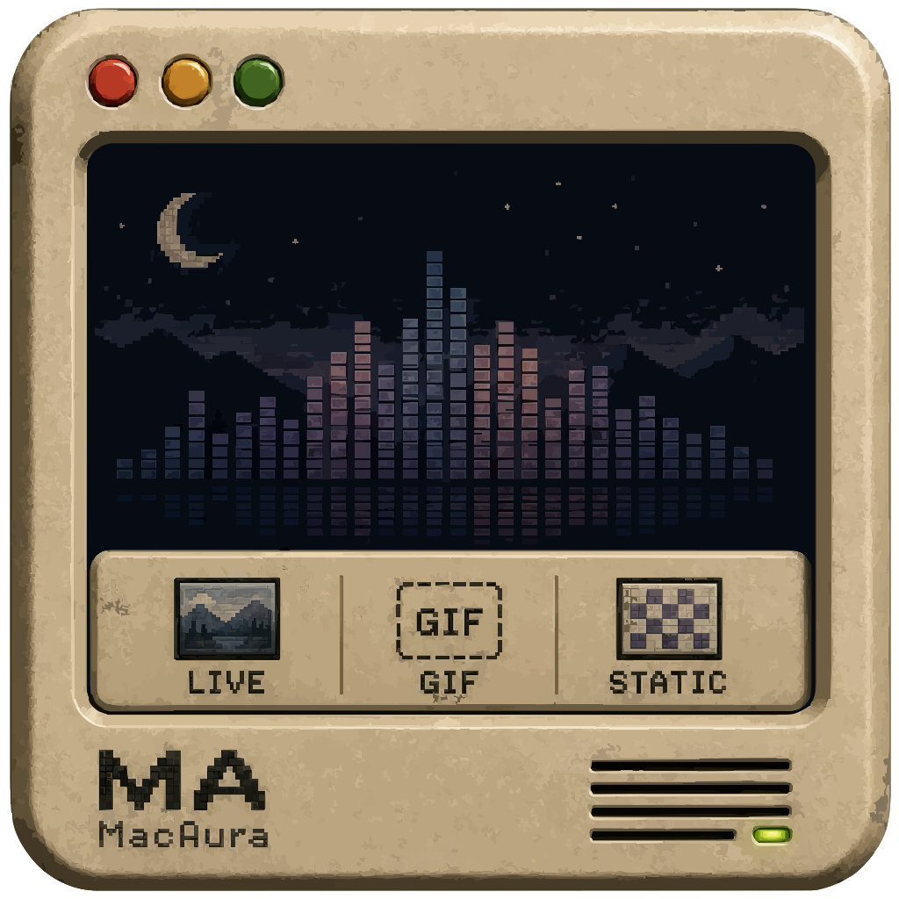
</p>

<p align="center">
  
  
  
  
  
</p>

<p align="center">
  <a href="https://github.com/ASKHOPE/MacAuraLive/releases/latest">
    
  </a>
</p>

> **MacAuraLive** is a lightweight, hardware-accelerated live wallpaper engine for macOS — built in pure Swift and SwiftUI with zero third-party binary dependencies. Runs natively on both **Apple Silicon (M1/M2/M3/M4)** and **Intel** Macs.
> 
> 🌐 **[Visit Official Webpage](https://askhope.github.io/MacAuraLive/)** | 📦 **[Download Direct DMG Installer (v1.8.0 Universal)](https://github.com/ASKHOPE/MacAuraLive/releases/latest/download/MacAuraLive_v1.8.0_Universal_Installer.dmg)** | 📄 **[View All Releases & Checksums](https://github.com/ASKHOPE/MacAuraLive/releases)**

> [!TIP]
> ### 🍎 macOS First-Time Launch Note (Gatekeeper Override)
> As an open-source application distributed directly on GitHub, macOS may display a standard *"Apple could not verify..."* dialog on first launch.
> 
> **Option 1 (Fastest — One-line Terminal command):**
> ```bash
> xattr -cr /Applications/MacAuraLive.app
> ```
> 
> **Option 2 (macOS Settings Override):**
> 1. **Right-click (Control-click)** on `MacAuraLive.app` in your Applications folder and select **Open**.
> 2. Or open **System Settings > Privacy & Security**, scroll to **Security**, and click **"Open Anyway"**.

---

## 📸 Application User Interface Gallery (Dark & Light Modes)

### 🌓 Adaptive macOS Appearance
MacAuraLive features full automatic dynamic adaptation to macOS Light and Dark modes with high-contrast glassmorphism surfaces.

| View / Feature | 🌙 Dark Mode | ☀️ Light Mode |
| :--- | :---: | :---: |
| **01. Live Wallpapers Gallery** | 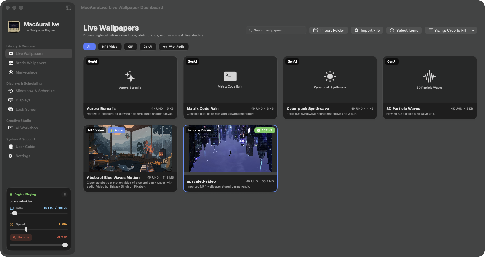 | 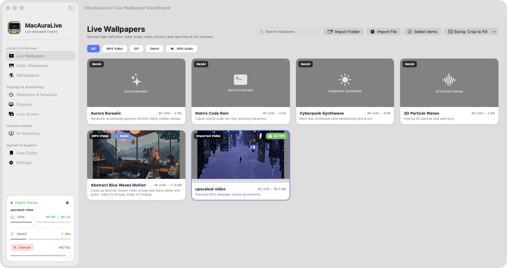 |
| **02. Static 4K Engine** | 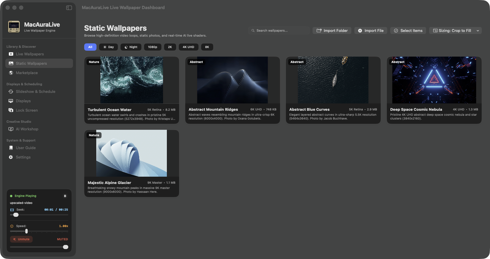 | 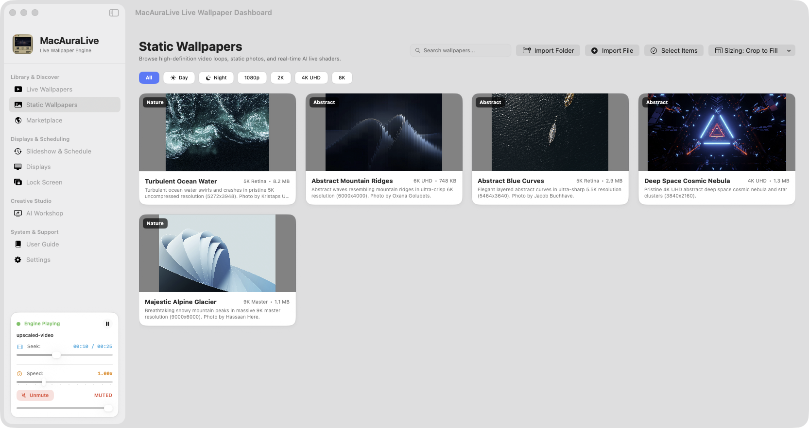 |
| **03. Slideshow & Schedules** | 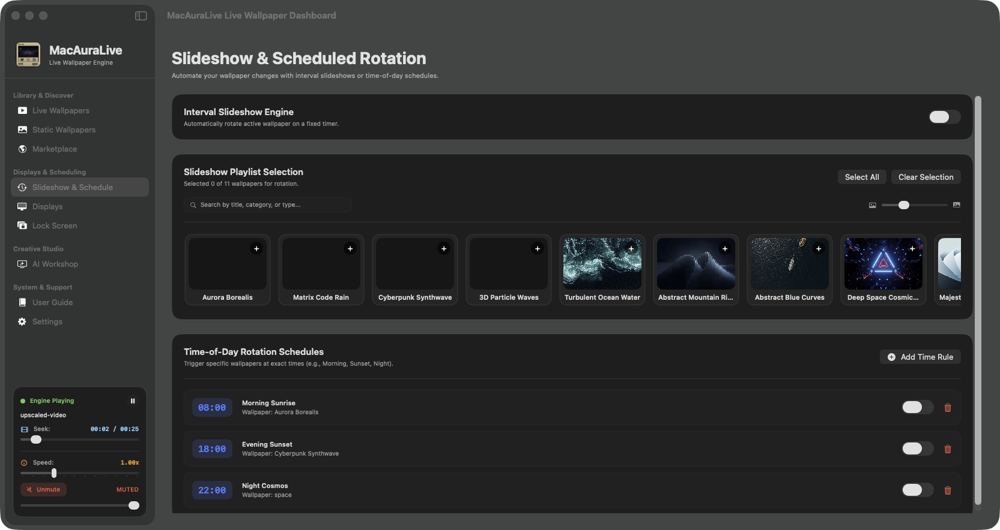 | 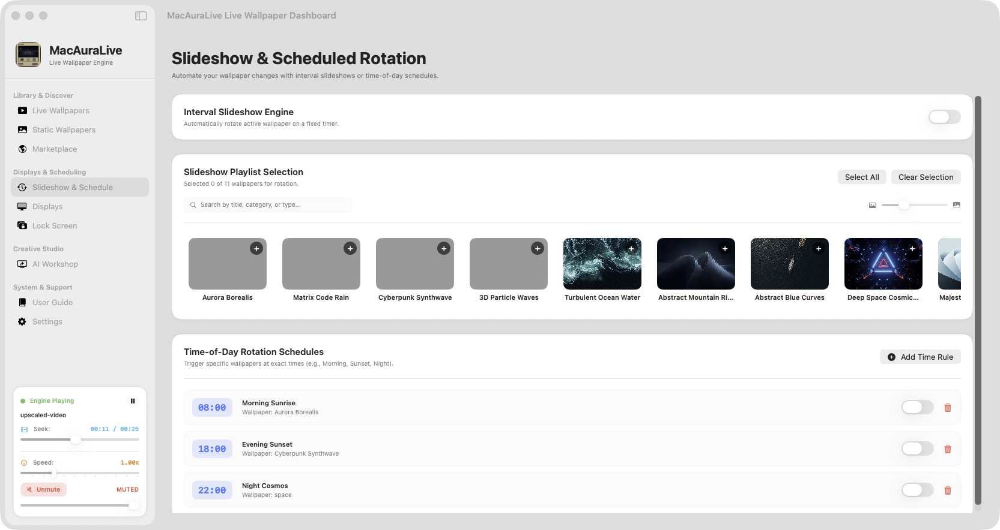 |
| **04. Multi-Monitor Displays** |  | 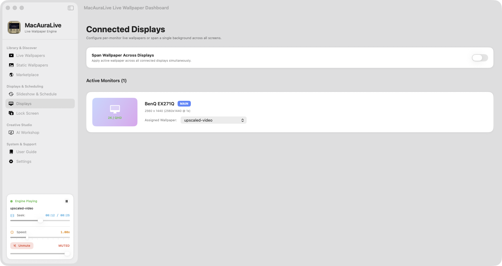 |
| **05. macOS Lock Screen** |  | 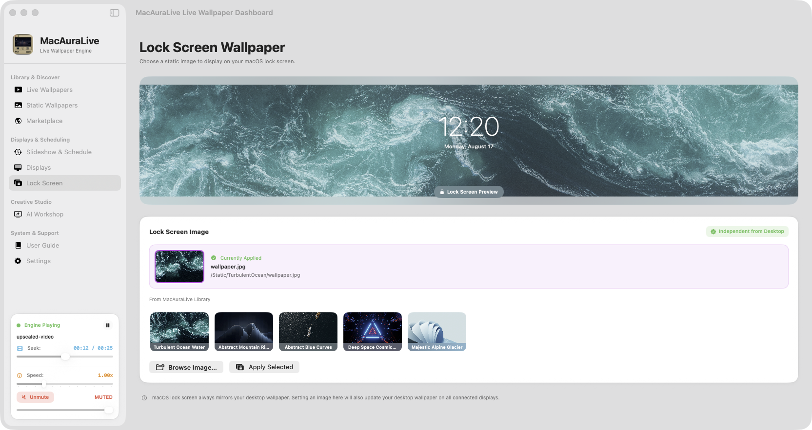 |
| **06. Built-in User Guide** | 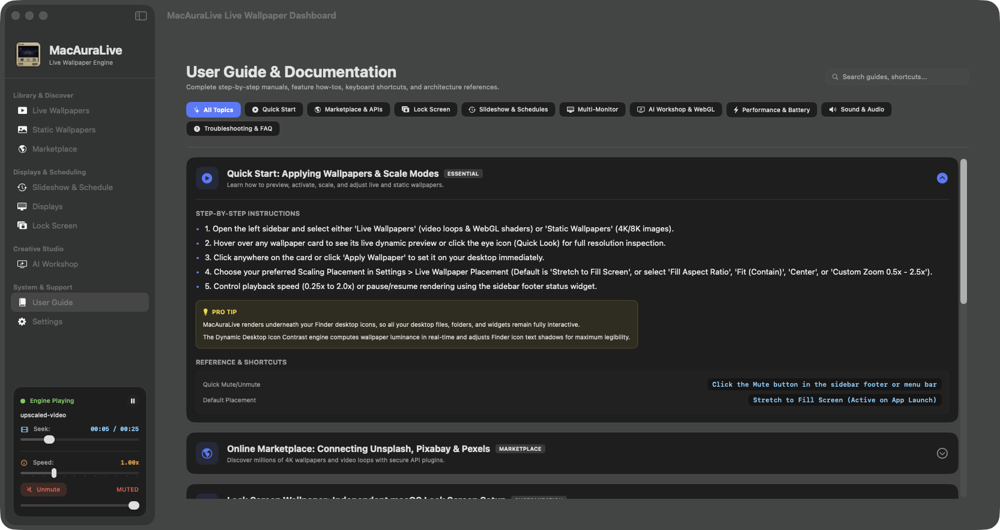 | 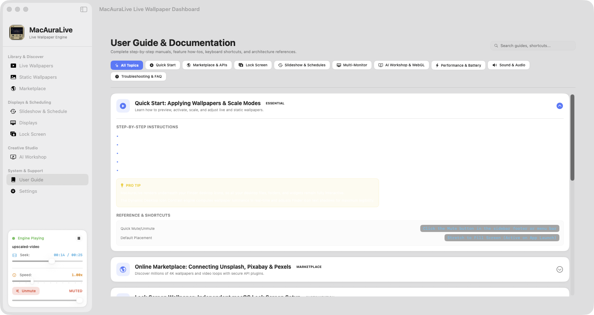 |
| **07. AI Scene Planner** | 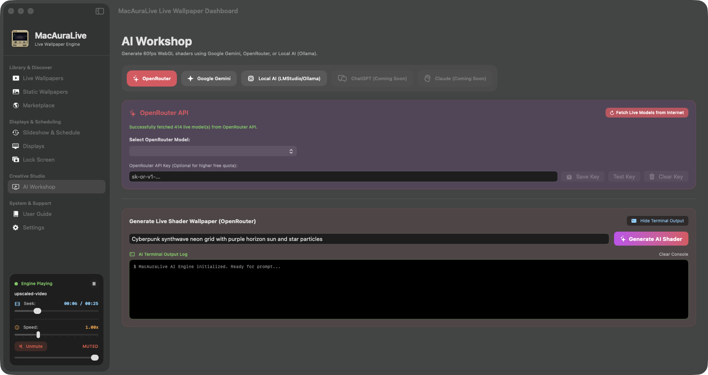 | 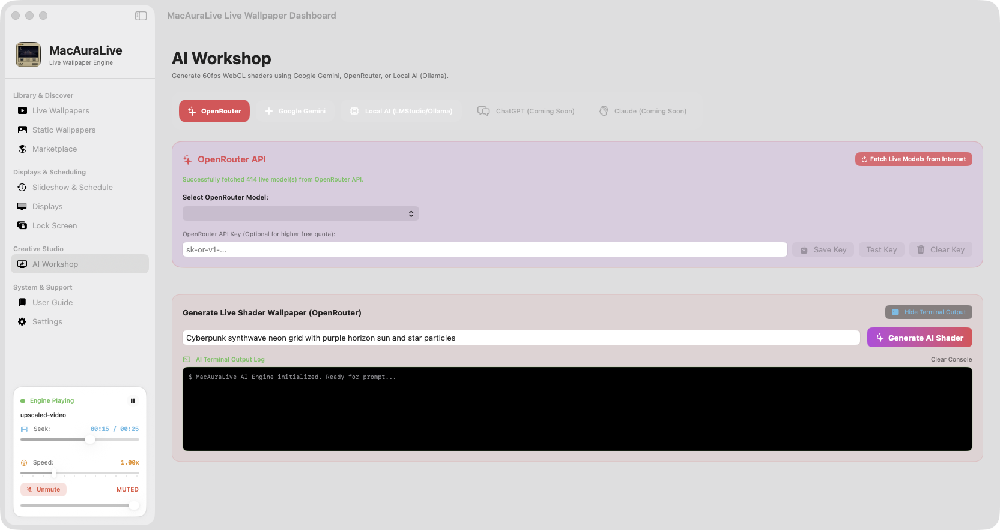 |
| **08. Settings & Storage** | 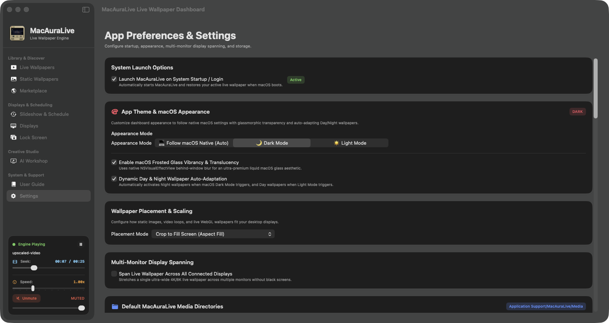 | 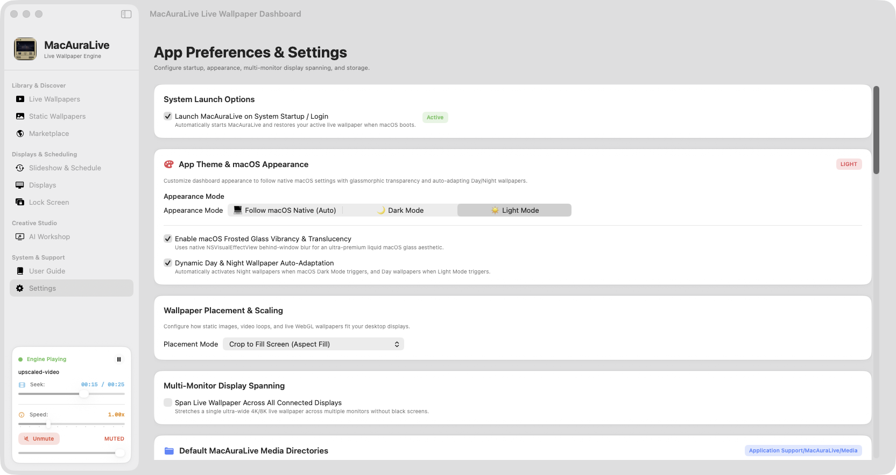 |
| **09. Marketplace Plugins** | 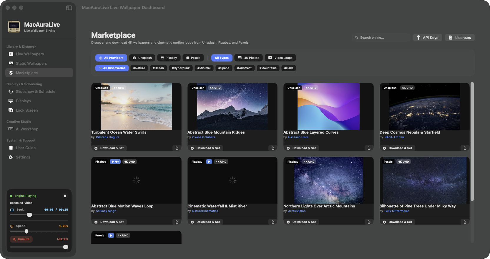 | 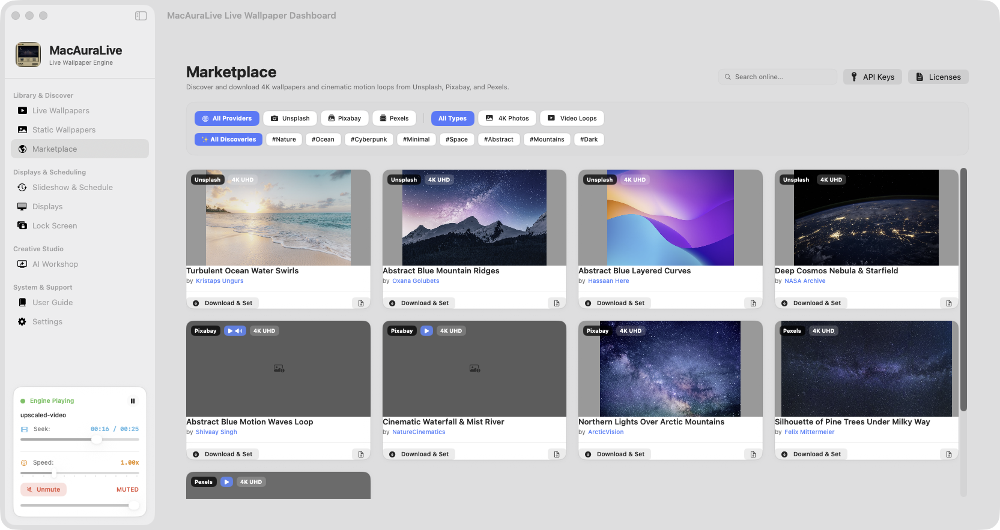 |

---

## ✨ Features

### 🎬 Live & Static Wallpaper Engine & Sizing Controls
- **Universal 2 Native Engine** — Pure Swift/Metal rendering running natively on **Apple Silicon (`arm64`)** and **Intel (`x86_64`)** Macs.
- **Native Static Wallpaper Engine (`StaticWallpaperView`)** — Pixel-perfect native AppKit CoreGraphics/Metal image rendering with zero WebKit overhead (< 35 MB RAM).
- **Default Original Resolution (macOS Native Fit)** — Renders wallpapers in their exact 1:1 pixel dimensions and native aspect ratios centered on the display, preventing distortion or forced cropping.
- **Interactive Sizing & Crop Controls** — Switch seamlessly between **Original (1:1)**, **Fit to Screen (Aspect Contain)**, **Crop to Fill (Aspect Fill)**, **Stretch to Fill**, and **Custom Zoom & Scale** in the Gallery header and preview modal.
- **Video Wallpapers** — Hardware-accelerated 1080p / 2K / 4K / 8K video loops via `AVFoundation` (H.264, HEVC/H.265, ProRes).
- **Interactive Video Seek Slider** — Real-time playback timeline slider with `MM:SS` duration tracking and live seeking for video wallpapers.
- **Interactive WebGL Shaders** — Full HTML5/WebGL/Canvas procedural wallpapers rendered in `WKWebView`.
- **Built-in Shader Pack** — Aurora Borealis, Matrix Digital Rain, Cyberpunk Synthwave, 3D Particle Wave.
- **Live Wallpaper 60 FPS Acceleration** — Optimized gallery thumbnails to prevent background WebKit process contention, maintaining solid 60/120 FPS desktop performance.

### 🤖 AI Wallpaper Workshop & Scene Planner
- Generate custom procedural live wallpapers using natural language prompts.
- Connect your own API keys for **Google Gemini 2.0 / 1.5 Flash**, **OpenRouter (DeepSeek R1, Llama 3.3, Qwen 2.5)**, **Anthropic Claude**, **OpenAI**, or **Local Offline LLMs (Ollama / LMStudio)**.
- **Dedicated Key Management Trio** — **Save Key**, **Test Key** (live API ping), and **Clear Key** buttons.
- All credentials stored in hardware **macOS Keychain** via `Security.framework` backed by Apple Silicon Secure Enclave.

### ⏰ Slideshow & Timed Rotation Engine
- **Interval Slideshow** — Automatically rotate active wallpapers on a configurable timer (30 sec, 5 min, 15 min, 1 hr, 24 hr).
- **Time-of-Day Schedules** — Assign specific wallpapers to trigger at exact times (e.g. 08:00 AM Sunrise, 18:00 PM Sunset, 22:00 PM Night Starfield).
- **Shuffle & Next Trigger** — Sequential or randomized rotation with instant manual "Rotate Now" action button.

### 🚀 System Startup & Launch at Login
- **Launch at Boot / Startup** — Powered by modern macOS `SMAppService.mainApp`.
- **Live Status Indicator** — Real-time feedback (`Active`, `Requires Approval`, `Not Registered`) in Settings & menu bar.
- **Quick Access Menu** — Toggle launch at login directly from the status bar menu icon.

### 🔒 Independent Lock Screen Wallpaper
- **Separate Lock Screen Image** — Choose an independent static wallpaper image for your macOS lock screen while keeping animated live wallpapers active on the desktop.
- **Live Lock Screen Preview** — Interactive preview card showing lock screen clock overlay with your selected image.

### 🖥️ Multi-Monitor Support
- Assign individual wallpapers per display or span/mirror across all connected screens.
- Dynamic hot-plug detection (`didChangeScreenParametersNotification`).
- Per-display zoom, fit, fill, and stretch placement modes.

### ⚡ Smart Power Management
- Auto-pause on battery with configurable threshold.
- Full-screen app detection automatically pauses rendering to give 100% GPU to active games and applications.
- Performance tiers: Full (60fps), Balanced (30fps), Low Power (15fps), Paused.

### 💾 Minified Footprint & Resource Analytics Dashboard
- **Minified Binary** — Stripped Universal 2 binary (~4.4 MB total for both ARM64 and x86_64 combined; ~2.2 MB single arch).
- **Real-Time Storage Breakdown** — Live analytics dashboard built directly into Settings tracking disk allocation across binary, live shaders, static wallpapers, and cache.
- **Real-Time File Size Badges** — Wallpaper card footers and quick-look preview modals dynamically display exact file sizes (e.g., `4K UHD • 12.4 MB`).
- **Duplicate Media Scanner & Cleaner** — Built-in SHA-256 byte scanner detects duplicate video, photo, and GIF assets across your library with 1-click batch cleanup.
- **Settings Backup & Migration (Export / Import)** — Export complete app configurations, display assignments, and slideshow rules to portable JSON or restore on a new Mac in seconds.
- **Granular Reset System** — Dedicated **Reset Only Media** (clears custom imported files and restores bundled pack while keeping all preferences intact), **Reset Only Preferences**, and **Full Factory Reset**.
- **Multi-Select & Batch Media Operations** — Multi-select mode across all gallery tabs with Select All, selection counter, and batch deletion.
- **One-Click Cache Management** — Instant cache cleanup and Finder reveal actions.

---

## 📊 Storage Usage & Resource Allocation Breakdown

| Component | Storage Type | Size | % of Total | Description |
| :--- | :--- | :--- | :--- | :--- |
| **App Executable (Universal 2)** | Mach-O Binary | **4.8 MB** | ~13% | Minified Universal dual-arch binary (ARM64 + Intel x86_64) |
| **Bundled 4K Video Loop** | Media Resource | **11.3 MB** | ~31% | High-bitrate 4K loop (`ShivaayWaves/wallpaper.mp4`) |
| **Bundled 4K Static Wallpapers** | Media Resource | **14.4 MB** | ~39% | 5 high-res desktop backdrops (Ocean, Mountains, Space, Glacier) |
| **App Branding & High-DPI Icons** | Asset Catalog | **6.5 MB** | ~17% | Retina 1024×1024 AppIcon.icns, StatusBarIcon & legal suite |
| **Built-in Shaders & Runtime** | HTML5/GLSL | **~60 KB** | <1% | 60fps Aurora, Matrix, Cyberpunk, Particle Wave shaders |
| **Total Uncompressed `.app`** | Combined Bundle | **~36.8 MB** | **100%** | Ultra-efficient footprint on Apple Silicon & Intel Macs |
| **Compressed DMG Installer** | Disk Image | **~34.1 MB** | — | Single universal installer from GitHub Releases |

---

## 🛠️ Architecture

```
MacAuraLive/
├── Package.swift                      # Swift Package Manifest (macOS 13.0+)
├── Scripts/
│   ├── build_app.sh                  # Universal 2 release build + symbol minifier
│   ├── create_installer_dmg.sh       # Universal DMG installer packager + Checksum generator
│   └── verify_environment.sh         # Pre-build audit & 7-part legal sync verifier
└── Sources/MacAuraLive/
    ├── MacAuraLiveApp.swift               # @main entry, NSStatusItem, Dock & Launch at Login toggles
    ├── Models/
    │   ├── WallpaperItem.swift        # Wallpaper data model
    │   ├── AppSettings.swift          # UserDefaults + Keychain settings & LaunchAtLogin status
    │   ├── DisplayInfo.swift          # Display/monitor state
    │   └── OnlineWallpaperPlugin.swift# Plugin protocol for Unsplash, Pixabay, Pexels
    ├── Core/
    │   ├── WallpaperEngine.swift      # Multi-monitor window orchestrator & playback speed delegation
    │   ├── StorageAnalyticsManager.swift # Live storage footprint calculator & resource analytics
    │   ├── WallpaperWindow.swift      # Below-desktop-icons NSWindow
    │   ├── StaticWallpaperView.swift  # Native CoreGraphics/Metal static wallpaper renderer
    │   ├── VideoWallpaperView.swift   # AVPlayerLooper 4K video renderer + seek & speed controls
    │   ├── WebWallpaperView.swift     # WKWebView HTML5/WebGL renderer + MacAuraLive SDK
    │   ├── WallpaperStorageManager.swift # Library persistence & file import (~/Documents/MacAuraLiveApp/)
    │   ├── SlideshowManager.swift     # Interval slideshow timer & time-of-day scheduled rules
    │   ├── AIGenerationManager.swift  # Multi-provider AI wallpaper generation & key testing
    │   ├── KeychainManager.swift      # Hardware Keychain AES-256 key storage
    │   ├── LockScreenManager.swift    # Lock screen static wallpaper application
    │   ├── SecurityHardeningManager.swift # Prompt injection filter & CSP sanitizer
    │   ├── OnlineMarketplaceManager.swift # Unsplash/Pixabay/Pexels aggregator
    │   ├── UpdateManager.swift        # GitHub Releases update checker
    │   └── PerformanceManager.swift   # Battery, thermal, FPS management
    ├── Views/
    │   ├── MainWindowView.swift       # SwiftUI dashboard, sidebar navigation & speed slider widget
    │   ├── GalleryView.swift          # Wallpaper grid, importer, preview cards with teardown
    │   ├── SlideshowView.swift        # Interval rotation & time-of-day schedule manager UI
    │   ├── SettingsView.swift         # Preferences, Storage Analytics, Changelog Modal, Legal Suite
    │   ├── AIConfigurationView.swift  # AI provider setup, Save/Test/Clear Key actions
    │   ├── MarketplaceView.swift      # Online wallpaper marketplace browser
    │   ├── DisplayManagerView.swift   # Per-display wallpaper assignment
    │   ├── UserGuideView.swift        # Searchable User Guide with responsive FlowLayout
    │   └── LockScreenView.swift       # Lock screen wallpaper picker & live preview
    └── Resources/
        ├── PrivacyInfo.xcprivacy      # Apple Privacy Manifest (Zero tracking, declared reasons)
        ├── Assets/
        │   ├── AppIcon.png            # Web-compatible browser App icon (1024x1024 PNG)
        │   ├── AppIcon.icns           # macOS bundle App icon
        │   └── StatusBarIcon.png      # Menu bar icon (18×18 @1x)
        ├── Runtime/                   # JavaScript wallpaper runtime engine
        └── Wallpapers/
            ├── Live/                  # Aurora, Matrix, Cyberpunk, ParticleWave
            ├── Static/                # Bundled default high-res static images
            └── Video/                 # Bundled ShivaayWaves 4K video loop
```

---

## 🚀 Getting Started

### Prerequisites
- macOS 13.0 Ventura or newer (macOS 13, 14 Sonoma, 15 Sequoia)
- Apple Silicon Mac (M1/M2/M3/M4) **OR** Intel Mac (Core i5/i7/i9)
- Xcode Command Line Tools (`xcode-select --install`) for compiling from source

### Build from Source

```bash
# 1. Clone repository
git clone https://github.com/ASKHOPE/MacAuraLive.git
cd MacAuraLive

# 2. Build the Universal 2 signed .app bundle
./Scripts/build_app.sh

# 3. Create DMG Installer & Checksums
./Scripts/create_installer_dmg.sh

# 4. Launch MacAuraLive
open build/MacAuraLive.app
```

---

## 🔐 Security & Privacy

| Area | Approach |
|---|---|
| **API Keys** | Stored exclusively in macOS **Keychain** via `Security.framework` (`kSecClassGenericPassword` with `kSecAttrAccessibleAfterFirstUnlockThisDeviceOnly`) — never saved in plaintext or `UserDefaults`. |
| **Privacy Manifest** | Official Apple `PrivacyInfo.xcprivacy` declaring `NSPrivacyTracking = false`, zero data collection, and declared reasons for `UserDefaults` (CA92.1) and `FileTimestamp` (C617.1). |
| **Wallpaper Data** | 100% local on-device execution — zero telemetry, zero analytics, zero tracking servers. |
| **Network** | Only outbound TLS connections are to user-configured AI APIs or online marketplace providers (Unsplash/Pixabay/Pexels). |
| **Security Hardening** | Automated Content Security Policy (CSP) injection blocking `eval()`, `Function()`, `fetch()`, `document.cookie`, and `localStorage` in generated shaders. |

---

## ⚖️ Legal & Compliance Documentation Suite

| Document | Description |
| :--- | :--- |
| **[LICENSE](LICENSE)** | Open-Source MIT License Grant |
| **[EULA.md](EULA.md)** | End User License & Usage Agreement |
| **[TERMS_OF_SERVICE.md](TERMS_OF_SERVICE.md)** | Terms of Service, User Responsibilities & Media Copyright Rules |
| **[PRIVACY_POLICY.md](PRIVACY_POLICY.md)** | 100% On-Device Privacy Policy & Permission Usage |
| **[THIRD_PARTY_LICENSES.md](THIRD_PARTY_LICENSES.md)** | Third-Party Media, Platform APIs & Framework Licenses |
| **[SECURITY.md](SECURITY.md)** | Security Architecture, Vulnerability Reporting & Keychain Protection |
| **[DMCA.md](DMCA.md)** | DMCA Copyright Policy & Takedown Notice Procedures |

### Disclaimer
> MacAuraLive is provided **"as-is"** without warranty of any kind. The authors are not responsible for any damage to hardware, software, data loss, or system instability arising from use of this application. Setting live wallpapers naturally increases GPU energy consumption; laptop users are encouraged to enable "Pause on Battery".

### Trademarks
Apple, macOS, Metal, AVFoundation, SwiftUI, and related marks are trademarks of **Apple Inc.** Unsplash, Pixabay, and Pexels are trademarks of their respective owners. MacAuraLive is an independent open-source project and is not affiliated with, endorsed by, or sponsored by Apple Inc. or third-party content platforms.

---

<p align="center">Made with ❤️ for macOS (Apple Silicon & Intel)</p>
